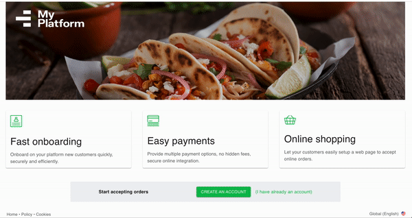

# Adyen for Platforms (AfP) Sample Application

[](https://gitpod.io/#https://github.com/adyen-examples/adyen-afp-sample)  
[First time with Gitpod?](https://github.com/adyen-examples/.github/blob/main/pages/gitpod-get-started.md)

## Intro

Adyen for Platforms is an end-to-end payment solution for peer-to-peer marketplaces, on-demand services, crowdfunding platforms, and any other platform business models.

This application is a simplified version of a platform that utilises AfP, showcasing the following use cases:
* Signup and start Hosted Onboarding
* Login and resume Hosted Onboarding
* View transactions

The frontend is implemented in React, the backend is in Java (Spring Boot) integrating the Adyen Java library 
([GitHub](https://github.com/Adyen/adyen-java-api-library) | [Documentation](https://docs.adyen.com/development-resources/libraries?tab=java_2)).



## Prerequisites

- Java 17
- Maven 3

## 1. Installation

```
git clone https://github.com/adyen-examples/adyen-afp-sample.git
```

## 2. Set the environment variables
* [BCL API key](https://docs.adyen.com/marketplaces-and-platforms/get-started/): API key for accessing Balance Platform [Configuration API](https://docs.adyen.com/api-explorer/balanceplatform/latest/overview)
* [LEM API key](https://docs.adyen.com/marketplaces-and-platforms/get-started/): API key for accessing [Legal Entity Management API](https://docs.adyen.com/api-explorer/legalentity/latest/overview)
* [API Key](https://docs.adyen.com/development-resources/api-credentials/#generate-api-key): API key for accessing [Checkout API](https://docs.adyen.com/api-explorer/Checkout) and [Management API](https://docs.adyen.com/api-explorer/Management/)
* [Merchant account](https://docs.adyen.com/account/account-structure/#merchant-accounts): the merchant account to to configure and process the payments
* [HMAC key](https://docs.adyen.com/development-resources/webhooks/verify-hmac-signatures): HMAC key to validate incoming webhook requests

On Linux/Mac/Windows export/set the environment variables.
```shell
export ADYEN_BCL_API_KEY=yourBclApiKey
export ADYEN_LEM_API_KEY=yourLemApiKey
export ADYEN_API_KEY=yourCheckoutApiKey
export ADYEN_MERCHANT_ACCOUNT=yourCheckoutMerchantAccount
export ADYEN_HMAC_KEY=yourHmacKey
```

Alternatively, define the variables in the `config/application.properties`.
```txt
ADYEN_BCL_API_KEY=yourBclApiKey
ADYEN_LEM_API_KEY=yourLemApiKey
ADYEN_API_KEY=yourCheckoutApiKey
ADYEN_MERCHANT_ACCOUNT=yourCheckoutMerchantAccount
ADYEN_HMAC_KEY=yourHmacKey
```

## 3. Run the application
You can run the sample application in 2 ways:
* run React and Java separately
* build and run the application JAR file
#### Run React and Java
Run separately frontend and backend:
```shell
cd react-app
npm start
```

```shell
mvn spring-boot:run
```

Access [http://localhost:3000/](http://localhost:3000/)

#### Build the application
Run the Spring Boot application, packaging the frontend and all assets together:
```   
mvn spring-boot:run -Dskip.frontend.build=false
```

Access [http://localhost:8080/](http://localhost:8080/)

# Webhooks

Webhooks deliver asynchronous notifications about the onboarding status and other events that are important to receive and process.  
Check out how to [setup a webhook](https://docs.adyen.com/marketplaces-and-platforms/webhooks/) 
and learn tips and best practises in [this blog post](https://www.adyen.com/knowledge-hub/consuming-webhooks).

### Webhook setup

In the [Balance Platform Customer Area](https://balanceplatform-test.adyen.com/balanceplatform) in the `Developers → Webhooks` section, 
create a new `Configuration` webhook.

A good practice is to set up basic authentication, copy the generated HMAC Key and store it as an environment variable. 
The application will use this to ensure the integrity of the incoming webhook requests.

Make sure the webhook is **enabled**, so it can receive notifications.

### Expose an endpoint

This demo provides a simple webhook implementation (`WebhookController` class) that processes the requests sent to `/api/webhooks/notifications` 
and demonstrates how to receive, validate and consume the webhook payload.

### Test your webhook

To make sure that the Adyen platform can reach your application, we have written a [Webhooks Testing Guide](https://github.com/adyen-examples/.github/blob/main/pages/webhooks-testing.md)
that explores several options on how you can easily achieve this (e.g. running on localhost or cloud).
